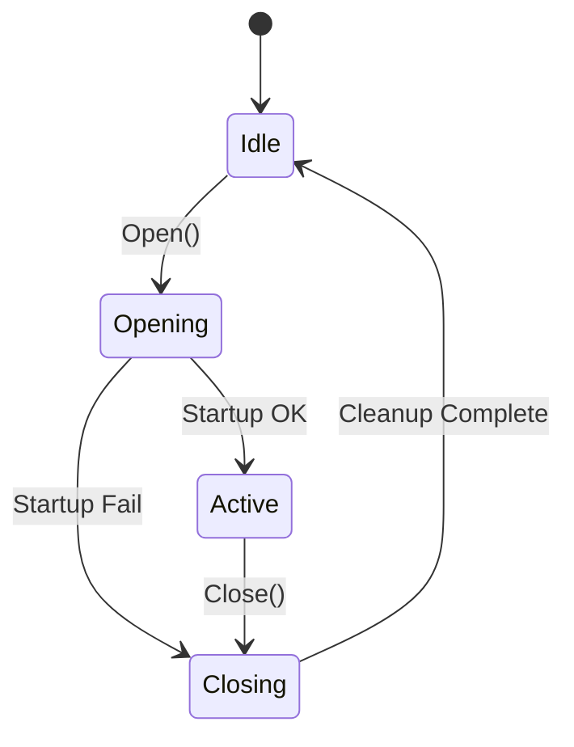

# SocketLibraryCPP

High-performance, thread-safe Windows socket library (TCP/UDP) for C++ with a single-header include surface:  
`SocketLibrary.h`

- **Platform:** Windows (Win32/x64)
- **Toolset:** MSVC / Visual Studio 2019–2022
- **Transport:** TCP & UDP (IPv4)
- **Threading:** Non-blocking multi-threaded sockets with async callbacks
- **Include once:** `#include "SocketLibrary.h"`
- **Namespace:** `SocketLibrary`
- **License:** MIT

---

## Contents
- [Features](#features)
- [Getting Started (contributors)](#getting-started-contributors)
  - [First-time IntelliSense Note](#first-time-intellisense-note)
- [Consuming via NuGet](#consuming-via-nuget)
  - [Headers & Libs Layout](#headers--libs-layout)
  - [Include and Link](#include-and-link)
- [Socket Lifecycle State Machine](#socket-lifecycle-state-machine)
- [Quick Usage](#quick-usage)
- [Troubleshooting](#troubleshooting)
- [Contributing](#contributing)
- [License](#license)

---

## Features
- Clean base `Socket` with lifecycle, error/update callbacks, and address helpers
- `TCPClientSocket`, `TCPServerSocket`, `UDPClientSocket`, and `UDPServerSocket` classes
- Graceful multi-threaded shutdown (`WorkerGroup`-managed)
- Auto WSA registration across sockets (ref-counted)
- Static library — no runtime dependencies
- Consistent four-state model across all socket types

> Tip: You can include just `SocketLibrary.h` for everything, or include specific headers like `SocketLibrary/TCPServerSocket.h` if you want to minimize compile units.

---

## Getting Started (contributors)

Clone and initialize the local NuGet package:

```bat
git clone <your fork or origin>
cd SocketLibraryCPP\build
Repackage.cmd
```

Then:

1. Open `SocketLibraryCPP.sln`  
2. Right-click the solution → **Restore NuGet Packages**  
3. Build your target (Debug/Release)

### First-time IntelliSense Note
When cloning fresh (when `packages/` doesn’t exist yet), IntelliSense may not immediately resolve `SocketLibrary.h` until Visual Studio refreshes.

**Fix once:**
1. Build the project at least once.  
2. Close Visual Studio.  
3. Delete the hidden `.vs/` folder.  
4. Reopen the solution.

---

## Consuming via NuGet

Once published, the package configures include & lib paths automatically.

### Headers & Libs Layout
```
build/native/
  SocketLibraryCPP.props
  SocketLibraryCPP.targets
  include/
    SocketLibrary.h
    SocketLibrary/*.h
  lib/<Platform>/<Configuration>/
    SocketLibraryCPP.lib
    SocketLibraryCPP.pdb
```

### Include and Link
```cpp
#include "SocketLibrary.h"
using namespace SocketLibrary; // optional
```
No manual include/lib path edits required.

---

## Socket Lifecycle State Machine

| State | Description |
|--------|--------------|
| **Idle** | Default; no active socket or worker. |
| **Opening** | `Open()` called, initializing WSA + socket. |
| **Active** | Socket successfully opened and workers running. |
| **Closing** | Graceful shutdown, worker stop, WSA unreg. |

TCP client additionally tracks `IsConnecting`, `IsConnected`, and `IsCancelling`.



---

## Quick Usage

### TCP Server (receive + echo, broadcast capable)
```cpp
#include <SocketLibrary/TCPServerSocket.h>
using namespace SocketLibrary;

int main() {
    TCPServerSocket server;
    server.SetErrorHandler([](const std::string& msg) {
        //Log error message
    });
    server.SetUpdateHandler([](const std::string& msg) {
        //Log update message
    });
    server.SetOnRead([&](unsigned char* data, size_t count, SOCKET client){
        server.Send(data, count, client); // Echo back
        //server.Broadcast(data, count);
    });
    server.SetOnClientDisconnect([](const std::string& addr) {
        //Handle client disconnect
    });
    server.SetServerIP("0.0.0.0");
    server.SetServerPort(55555);
    server.SetMaxLength(1000);
    if(!server.Open()) {
        return 1;
    }
    while(true) {
        std::this_thread::sleep_for(std::chrono::milliseconds(50));
    }
    server.Close();
}
```

---

### TCP Client (connect + send)
```cpp
#include <string>
#include <SocketLibrary/TCPClientSocket.h>
using namespace SocketLibrary;

int main() {
    TCPClientSocket client;
    client.SetErrorHandler([](const std::string& msg) {
        //Log error message
    });
    client.SetUpdateHandler([](const std::string& msg) {
        //Log update message
    });
    client.SetOnRead([](unsigned char* data, size_t count) {
        //Handle message
    });
    client.SetOnDisconnect([]() {
        //Handle disconnect
    });
    client.SetServerIP("127.0.0.1");
    client.SetServerPort(55555);
    client.SetMaxLength(1000);
    if(!client.Open()) {
        return 1;
    }
    std::string msg = "hello";
    client.Send(msg.c_str(), msg.size());
    while(true) {
        std::this_thread::sleep_for(std::chrono::milliseconds(50));
    }
    client.Close();
}
```

---

### UDP Server (bind + echo, broadcast capable)
```cpp
#include <SocketLibrary/UDPServerSocket.h>
using namespace SocketLibrary;

int main() {
    UDPServerSocket server;
    server.SetErrorHandler([](const std::string& msg) {
        //Log error message
    });
    server.SetUpdateHandler([](const std::string& msg) {
        //Log update message
    });
    server.SetOnRead([&](unsigned char* data, size_t count, sockaddr_in client){
        server.Send(data, count, client); // Echo back
        //server.Broadcast(data, count);
    });
    server.SetServerIP("0.0.0.0");
    server.SetServerPort(55555);
    if(!server.Open()) {
        return 1;
    }
    while(true) {
        std::this_thread::sleep_for(std::chrono::milliseconds(50));
    }
    server.Close();
}
```

---

### UDP Client (ephemeral bind + target caching)
```cpp
#include <string>
#include <SocketLibrary/UDPClientSocket.h>
using namespace SocketLibrary;

int main() {
    UDPClientSocket client;
    client.SetErrorHandler([](const std::string& msg) {
        //Log error message
    });
    client.SetUpdateHandler([](const std::string& msg) {
        //Log update message
    });
    client.SetOnRead([](unsigned char* data, size_t count, sockaddr_in sender) {
        //Handle message
    });
    client.SetServerIP("127.0.0.1");
    client.SetServerPort(55555);
    if(!client.Open()) {
        return 1;
    }
    std::string msg = "hello";
    client.Send(msg.c_str(), msg.size()); // uses cached target
    //client.Send(msg.c_str(), msg.size(), "127.0.0.1", 55555);
    while(true) {
        std::this_thread::sleep_for(std::chrono::milliseconds(50));
    }
    client.Close();
}
```
---

## Troubleshooting

| Issue | Resolution |
|--------|-------------|
| **IntelliSense errors on fresh clone** | Build once, delete `.vs/`, reopen solution |
| **Link errors** | Check platform/config matches shipped libs |
| **Include order errors** | Include our headers before `<Windows.h>` |
| **TCP "address in use"** | Library uses `SO_EXCLUSIVEADDRUSE`; ensure port is free |
| **Partial sends** | Peer closed or fatal socket error; logged via `ErrorHandler` |

---

## Contributing
- Run `build\Repackage.cmd` before opening the solution.  
- Keep headers self-contained (`SocketLibrary/*.h`).  
- Follow consistent naming and thread-safe practices.

---

## License
MIT — see [LICENSE](LICENSE).

---

### Repository Structure (quick view)
```
include/
  SocketLibrary.h
  SocketLibrary/
    ConnectionManager.h
    Socket.h
    TCPClientSocket.h
    TCPServerSocket.h
    UDPClientSocket.h
    UDPServerSocket.h
    WinSock2First.h
    WorkerGroup.h
src/
  SocketLibraryCPP/
  examples/
build/
  assets/
  native/
  scripts/
```

---

### Related
- **NuGet Package:** SocketLibraryCPP (coming soon)
- **Examples:** see `src/examples`
