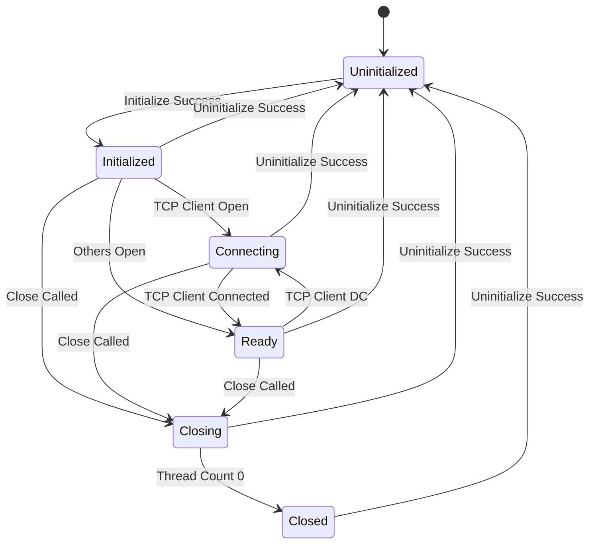

# SocketLibraryCPP

High-performance, thread-safe Windows socket library (TCP/UDP) for C++ with a simple, single-header include surface: `SocketLibrary.h`.

- **Platform:** Windows (Win32/x64)
- **Toolset:** MSVC / Visual Studio 2019–2022
- **Transport:** TCP & UDP (IPv4)
- **Threading:** Non-blocking multi-threaded sockets leveraging user callbacks
- **Include once:** `#include "SocketLibrary.h"`
- **Namespace:** `SocketLibrary`
- **License:** MIT

---

## Contents
- [Features](#features)  
- [Getting Started (contributors)](#getting-started-contributors)  
  - [First-time IntelliSense note (please read)](#first-time-intellisense-note-please-read)  
- [Consuming via NuGet (packages.config)](#consuming-via-nuget-packagesconfig)  
  - [Headers & libs layout](#headers--libs-layout)  
  - [Include and link](#include-and-link)  
- [Socket Lifecycle State Machine](#socket-lifecycle-state-machine)  
- [Quick Usage](#quick-usage)  
- [Troubleshooting](#troubleshooting)  
- [Contributing](#contributing)  
- [License](#license)

---

## Features

- Clean base `Socket` with error/update callbacks, address helpers, and lifecycle utilities
- TCP client/server and UDP client/server classes
- Safe worker thread lifecycle and graceful shutdown
- Ref-counted WSA init/uninit across sockets

---

## Getting Started (contributors)

```bat
git clone <your fork or origin>
cd SocketLibraryCPP\build
Repackage.cmd
```

Then:

1) Open `SocketLibraryCPP.sln`  
2) Right-click **Solution** → **Restore NuGet Packages**  
3) Build your target(s)

### First-time IntelliSense note (please read)

On a **fresh clone** (when `packages/` doesn’t exist yet), Visual Studio IntelliSense may not recognize the `SocketLibrary.h` file or the `SocketLibrary` namespace until its database refreshes (builds will still succeed though).

**One-time fix on fresh clones:**  
1) Once NuGet packages have been restored - **Close Visual Studio**
2) **Delete the hidden .vs directory**
3) **Open `SocketLibraryCPP.sln` again**

---

## Consuming via NuGet (packages.config)

This package auto-configures include & lib paths for all configurations and platforms.

### Headers & libs layout

```
build/native/
  SocketLibraryCPP.props
  SocketLibraryCPP.targets
  include/
    SocketLibrary.h
    SocketLibrary/*.h
  lib/<Platform>/<Configuration>/
    SocketLibraryCPP.lib
    SocketLibraryCPP.pdb
```

### Include and link

```cpp
#include "SocketLibrary.h"
using namespace SocketLibrary; // optional
```

No manual include/lib path edits required.

---

## Socket Lifecycle State Machine

From the public API’s perspective, sockets appear in these states:

| State | Meaning |
|---|---|
| **Uninitialized** | No resources registered; default state after full uninit. |
| **Initialized** | A Winsock socket is created and WSA is registered; ready to proceed. |
| **Connecting** | **TCP client only** — connection attempt in progress. |
| **Ready** | Actively processing I/O: connected (TCP client), accepting (TCP server), or receiving (UDP). |
| **Closing** | Graceful shutdown in progress. |
| **Closed** | Workers finished and handle closed, prior to explicit uninit.

> **Active flag** — `GetActive()` is observable and true in **Ready**; it’s set when accept/recv/connected loops start and cleared on close/teardown.

#### Diagram



**Why these transitions:**  
- TCP client uses `IsConnecting`/`IsConnected` and sets `Active` on connect; message loop runs until disconnect, then it reinitializes and can reconnect.  
- TCP server/UDP go straight from **Initialized** to **Ready** on `Open()` and set `Active` when their worker loops begin.  
- `Close()` sets **Closing**, clears **Active**, shuts down the handle, stops workers, and unregisters WSA—leading to **Closed** then **Uninitialized** on full uninit.

---

## Quick Usage

```cpp
#include "SocketLibrary.h"
using namespace SocketLibrary;

int main() {
  TCPClientSocket client;
  client.SetServerIP("127.0.0.1");
  client.SetServerPort(55555);
  client.SetMessageLength(1024);
  client.SetUpdateHandler([](const std::string& m){ /* log m */ });
  client.SetErrorHandler([](const std::string& e){ /* log e */ });

  client.Open(); // Initialized -> Connecting -> Ready (on connect)
  // ... use client ...
  client.Close(); // -> Closing -> Closed/Uninitialized
}
```

---

## Troubleshooting

- **Squiggle on `SocketLibrary.h` after fresh clone:** build once to restore NuGet, then **restart Visual Studio** (or toggle platform).  
- **Link errors:** verify the NuGet package is installed and you’re on a shipped config (Win32/x64; Debug/Release).  
- **Custom paths:** package settings **merge**, they don’t overwrite yours.

---

## Contributing

- Run `build\Repackage.cmd` before opening the solution to prime local packages  
- Follow the first-time IntelliSense note on fresh clones  
- Keep public headers self-contained under `SocketLibrary/`

---

## License

MIT — see [LICENSE](LICENSE).
